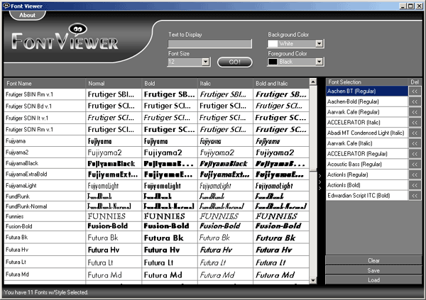
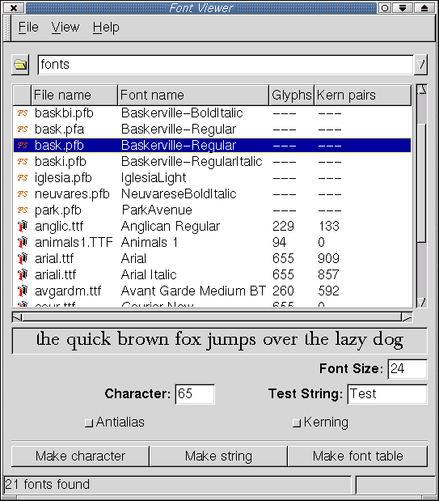
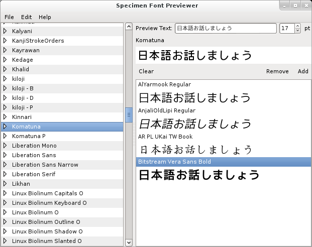
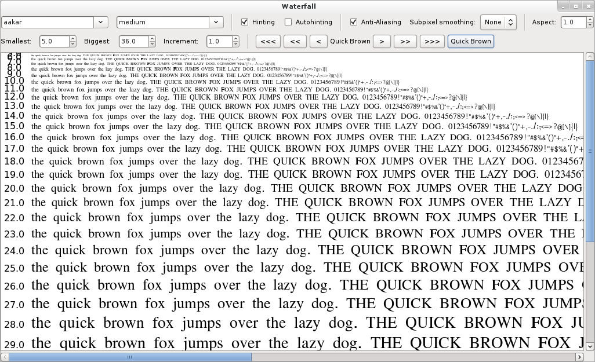
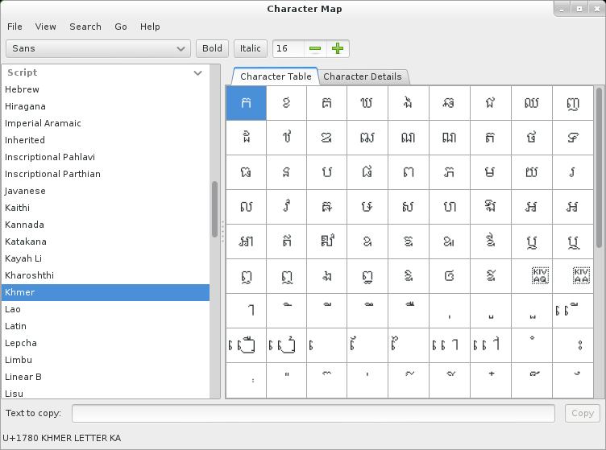

# Prior Art

## Font Viewer

[Website](http://fontviewer.net/)

Pleasantly sparse interface with obnoxious branding.

The grid display of different font weights is a nice touch. 

## GFontView

[Website](http://gfontview.sourceforge.net/)

Based on files rather than installed fonts.

Only shows one font at a time.

## Gnome Specimen

Clean interface. Does not allow filtering by desired script or text.

## Waterfall

Allows easy switching between different parts of the character set.

## Character Map

A different way of selecting scripts. Nice balanced UI.
